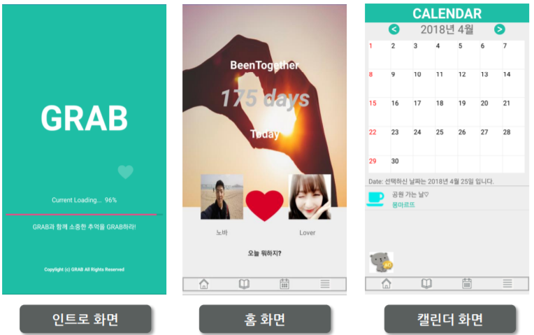
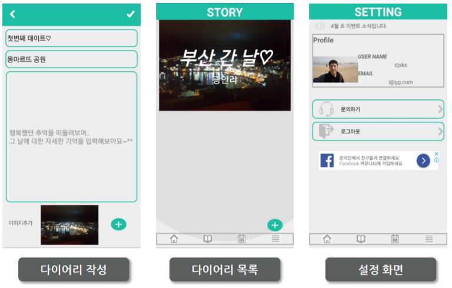

GRAB (커플 다이어리 앱)
===

## [기획의도]

사랑하는 사람과의 잊고 싶지 않은 소중한 추억들. . .
어떻게 하면 모두 놓치지 않을 수 있을까요?
GRAB과 함께 소중한 추억을 GRAB 하라 !

커플에 초점을 맞추고 앱을 제작하였습니다.
시중에는 다양한 스케쥴러 및 메모장 앱이 존재합니다. 
하지만 사랑하는 사람과 있었던 추억만을 온전히 저장하기 위한 공간이 필요하다는 생각을 했고, ‘GRAB’ 이라는 앱을 만들게 되었습니다.

## [앱 소개] 

#### 인트로 화면
로딩 시간을 지루하지 않게 만드는데 초점을 두었으며, 앱의 핵심 표어(소중한 사람과의 추억을 GRAB하라)가 사용자에게 잘 심어 들게끔 구현 하였습니다
- 애니메이션 효과를 이용해 앱 이름 회전 및 하트가 커졌다 작아졌다함
- AsyncTask를 이용해 시간의 흐름에 따라 progressbar에 로딩 진행률 표시

#### 로그인 및 회원가입 화면

회원가입을 귀찮아 하는 요즘 사람들을 위해 회원가입 화면을 최대한 간단하게 만들려고 했습니다. (AIR B&B 앱을 벤치마킹했습니다.) 그리고 기초반 때 사용할 수 있는 기술들을 이용해 실제 로그인 기능과 비슷하게 구현하려고 했습니다.
(회원가입 시)
- SharedPreferences를 회원가입 시 입력한 모든 값 저장 및 기존에 저장되어 있는 e-mail값들을 불러와 아이디 중복 체크 
- Password와 PasswordConfirm이 다르게 입력 되면 빨간줄을 발생 시키게 했으며, 개인정보의 안전성 확보조치 기준에 근거한 비밀번호 기준을 설정
  
(로그인 시)
- 로그인 시 아이디의 존재 여부 판별 및 비밀번호 체크
- 자동로그인 체크 후 로그인 시 다시 앱을 실행시키면 자동 로그인됨

#### 홈 화면

 커플들이 사용하는 앱의 메인 답게 꾸미는 것에 초점을 맞추었습니다. 홈에서는 커플들을 위한 재밌는 기능들 (D-day, 하트색깔변경, 오늘 뭐하지?)을 구현했습니다.
- D-day를 꾸욱 클릭하면 D-day 설정화면으로 넘어갑니다. 거기서 DatePickerDialog를 이용해 날짜 설정
- 자신의 애칭 및 프로필 사진 변경 가능하고 홈 화면의 큰 사진도 꾸욱 클릭해서 변경 가능
- 하트 클릭 시 색깔이 바뀜. 현재 커플의 상태를 나타내고자 만듬. (놀러가고 싶어요. 배고파요 등)
- 오늘 뭐하지?를 클릭하면 테마별로 데이트 추천 장소 볼 수 있음.

#### 스토리 화면

스토리 화면에서는 추억을 떠올리기 위한 심플한 화면 구성에 초점을 맞추었습니다. (정보의 과다 노출 방지로 추억이 마구잡이로 떠오르는 것을 방지)
  1. 한 아이템에 많은 내용을 담기보다 심플하게 구성
추억을 떠올릴 수 있는 중요한 요소인 사진이 크게 들어가 있는 것이 포인트. 
제목과 부제목을 통해 그 날의 핵심 기억을 잘 떠오르게 만들었고 오른쪽 구석에 날짜를 추가해서 보기 쉽게 구성.
  2. 한 화면에는 2개의 스토리 일기만 나타나게 만들었습니다.

#### 캘린더 화면

 안드로이드 스튜디오에 있는 Calender View의 경우 아주 기본적인 기능들만 제공한다는 것을 깨닫고 커스텀한 캘린더를 만들었습니다. 
- 캘린더의 날짜를 꾸욱 클릭하면 일정을 추가 및 삭제 할 수 있습니다.

#### 설정 화면

 회원가입 시 입력한 정보를 Profile View를 통해서 볼 수 있고, 공지사항 및 문의하기 등 앱의 부가적인 기능을 설정화면에다 추가했습니다.
- 문의하기를 통해 전화 및 홈페이지 문의가 가능합니다.
- 공지사항의 내용이 5초마다 전환이 됩니다 
- 로그아웃을 할 수 있습니다.
- 구글 Ad View를 이용한 구글 광고 배너를 띄웠습니다.
+메인(홈,스토리,캘린더,설정)화면에서 빽 버튼 3초내 2번 클릭 시 앱 종료됨. 

## 정리
1. 액티비티 : Air B&B, Between, 숨고 앱 액티비티 벤치 마크 하면서 화면 구현
2. 인텐트 : 화면간 전환, 데이터 이동하는 것에 초점 및 암시적 인텐트 이용해서 전화 및 홈페이지 방문 가능.
3. 리스트뷰 : 추억 저장을 위한 스토리 화면 및 캘린더의 일정 추가를 위한 리스트 뷰 사용
4. 쉐어드 : 쉐어드를 이용해서 저장이 필요한 모든 부분을 저장. 앱을 종료 후 다시 실행 시켜도 기존에 입력한 값들이 모두 저장됨.
5. 쓰레드 : 로딩화면 진행 상태 및 설정화면에서 공지사항이 5초 간격으로 계속해서 변경되게함.
6. 애니메이션 : 인트로 화면 GRAB 회전, 스토리화면의 리스트뷰 각 아이템이 점점 확대되게끔 그리고 위아래로 스크롤 시 통통 튀기는 효과 적용, 화면간 전환 시 좌우로 화면 전환(각 화면의 세부적인 기능으로 이동 시 위아래로 화면 전환), 강조하고 싶은 부분은 깜빡거리게 함.